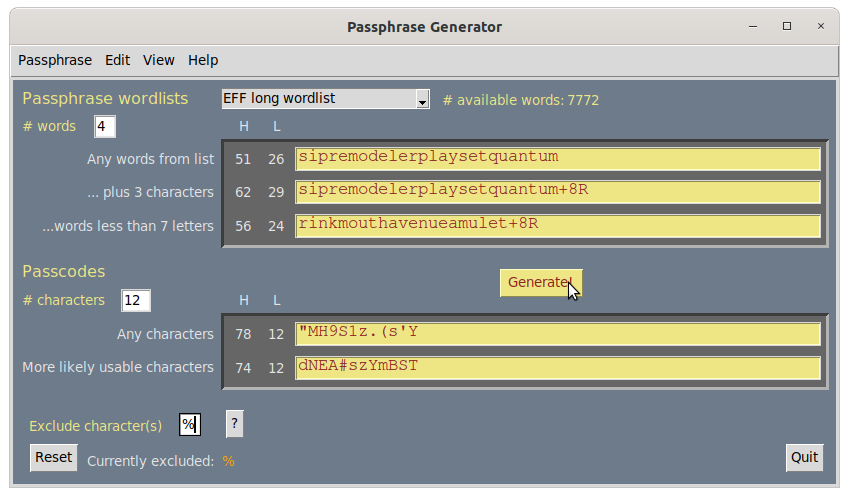

# Passphrases Project
Python GUI scripts and cross-platform executables to easily make secure passphrases and passwords.

A potential problem with some on-line password and passphrase generators is that they are on-line. Here is something that can be run locally and privately either as a standalone program on **Windows** and **MacOS** or as a Python script from a Terminal window in **Windows**, **MacOS**, or **Linux**. 

Words and character strings are randomized with Python's Random class using a random seed: random.Random(random.random()). For more information, see https://docs.python.org/3/library/random.html#random.random

The different pass-strings generated provide options for compliance with a range of website and application requirements. 
Suggestions for improvement are welcome, especially ideas to access the system dictionary on Windows.



#### Requirements
Developed with Python 3.8-3.9, under Ubuntu 20.04, Windows 10, and MacOS 10.13.6 & 11.1. The standalone programs do not need Python installation. 
Running from the command line requires Python 3.6 or later, preferably 3.7 or later. A recent tkinter graphics module of Python is required, which is included in Python 3.7+; earlier versions will require installation of Tk/Tcl. Recent Python packages can be downloaded from https://www.python.org/downloads/.

## Usage
To get started, download the repository package by clicking on the Code download button and select the Download ZIP option, or use git commands if you are comfortable with that. Unzipping (extracting) the zip file will create a passphrases-master directory. Once the program is launched, click Generate! to make passphrases and passwords. Results can be copied. Passphrase and password lengths are set by the user. Usage details and what to do with individual files on different operating systems are outlined below.

### GUI Implementations
#### passphrase.py
Running the script brings up an interactive graphics window to generate passphrases and password strings. On **MacOS** and **Linux** there is an option to create passphrases using either the system dictionary or the Electronic Frontier Foundation's long wordlist. On **Windows**, only the EFF word list is used. The number of words used for each option can be seen from the pulldown menu: `Help -> What are passphrases?`. The passphrase.py script is launched from a Terminal command line. 

For **Windows**, the folder, `wordlists`, included in this distribution, must be kept in the passphrases-master folder. Launching the program by double-clicking on the passphrase.py icon may work if .py is in your PATH list. Otherwise, launch a Terminal window opened from the passphrases-master folder and enter the command ```python3 passphrase.py``` or ```python passphrase.py``` or ```py passphrase.py```, depending on your system environment. 

For **Linux** or **MacOS**, the EFF `wordlists` directory also needs to be in the passphrases-master folder, but its use for generating passphrases is optional. The default source for words is your system dictionary. Launch the script from a Terminal window opened within the passphrases-master folder using the command 
```python3 ./passphrase.py``` or ```./passphrase.py```  On **MacOS**, a Python Launcher is bundled with some Python installations and can be configured to run passphrase.py by double-clicking on it.

### Stand-alone versions (no Python installation needed!)
#### Passphrase.app - MacOS
A **MacOS** standalone of passphrase.py. Download an extract the GitHub distribution package as outlined above. Inside passphrases-master/Standalone_distributables folder is `Passphrase_mac.app.zip`. Unzip that (just double click and follow prompts) to install the `Passphrase.app`, which you can place where ever you like. The distributable app ZIP file can be downloaded directly from https://github.com/csecht/passphrase-generate/raw/master/Standalone_distributables/Passphrase_mac.app.zip. The first time you double-click on the app, however, you will most likely get a message saying it can't be used; simply go into System Preferences > Security & Privacy > General and allow the app to open. It doesn't open initially because it was not downloaded from the Apple Store or from a recognized Apple developer. `Passphrase.app` was created with `py2app` from https://pypi.org/project/py2app/

#### Passphrase.exe - Windows
A **Windows** standalone of passphrase.py. Download an extract the GitHub distribution package as outlined above. Inside the `passphrases-master/Standalone_distributables` folder is `Passphrase_win.zip`, an archived folder of files necessary for running the Windows executable. This distributable archive can be downloaded directly from  https://github.com/csecht/passphrase-generate/raw/master/Standalone_distributables/Passphrase_win.zip. Extract All for that ZIP file. Within the extracted Passphrase_win folder is the executable, `Passphrase.exe` (the .exe extension may not show, depending on your system view settings). Double-click `Passphrase.exe` to launch. You will likely first need to permit Windows to open it: from the pop-up warning, click on "more info", then follow the prompts to open the program. The `Passphrase_win` folder can be placed anywhere, but you may want to create an alias of `Passphrase.exe` to move to a convenient location for easy access. The `Passphrase_win` distributable was created with `py2exe` from https://pypi.org/project/py2exe/

## Wordlist sources:
Optional wordlists were derived from texts obtained from these sites:
- https://www.gutenberg.org
- https://www.archives.gov/founding-docs/constitution-transcript
- https://www.eff.org/files/2016/07/18/eff_large_wordlist.txt

The `make_wordlist.py` script from https://github.com/csecht/make_wordlist was used to create the custom wordlists used here. That repository also includes source text files for these wordlists.

## Tips:
The program places no limits on the length of pass-strings, though your system memory might. The program's entry fields have a fixed width, but can accommodate longer entries. The window can be dragged to accommodate longer results up to a limit; results exceeding that limit can still be copied and pasted.

## Development plans:
- Make Debian package
